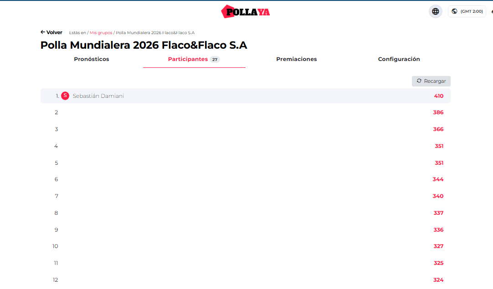
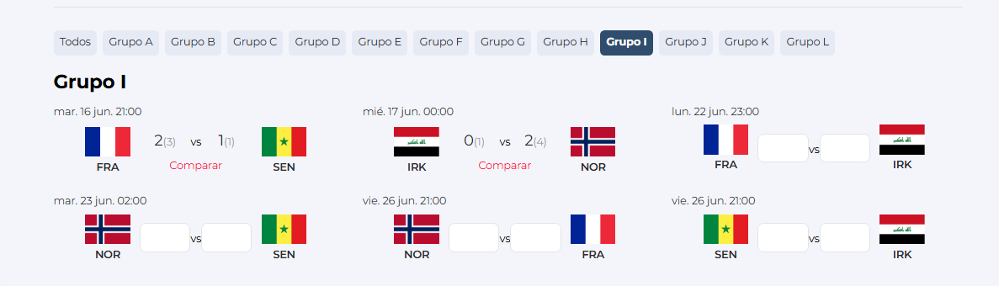

# pollagol-sim

Deterministic score predictor for a private 27-person FIFA World Cup 2026 prediction pool: for each match it picks the scoreline that maximizes *expected competition points* under the pool's own scoring rubric, which is rarely the most probable score.


-brightgreen)

Built and run solo for a private, invite-only pool on pollaya.com over the June-July 2026 World Cup. Closed and frozen since the tournament ended, so this README documents a finished system.

## Demo

Final standings, 27 participants, tournament closed 2026-07-21:



Per-matchday picks vs. actual results (one of many logged rounds):



The two images above are the only screenshots in the repo; other participants' names are masked. Every recorded pick in `predictions/decisions.csv` is cross-checked against a dated screenshot of the platform's own picks-vs-actual view before being marked reviewed, so the CSV is reconciled against an external, independently timestamped record rather than standing on its own.

## Architecture

```
 odds providers                 engine (src/)                    output
 ───────────────                ──────────────                   ──────
 The Odds API      ─┐                                        ┌─> predictions/decisions.csv
 (soccer_fifa_      │   src/ingest.py                         │   (per-match pick, EV, reasoning,
  world_cup market)  ├─> snapshot to data/snapshots/*.json ─┐ │    result, points scored)
                     │                                       │ │
 API-Football        │   src/strength.py                     │ │
 (season coverage    ┘   (de-vig 1X2 + totals -> strength)    │ │
  gap on free tier,                                           │ │
  see Limitations)        src/model.py (Dixon-Coles)          │ │
                          fit_lambdas -> score matrix P(i,j)   │ │
                          fixed or fitted rho (rho-fit branch) │ │
                                    |                          │ │
                          src/context.py / ko_adjust.py        │ │
                          (knockout, neutral-venue adjustments)│ │
                                    |                          │ │
                          src/optimizer.py                     │ │
                          argmax E[points] over rubric          ├─┘
                          (exact 3 / outcome 3 / goals <=2 / GD 1)
                                    |
                          src/decision_score.py  ───────────────┘
                          scores recorded picks vs. baselines
                          (I3: results feed the scorer only,
                           never a model parameter, see below)
                                    |
                          council/run_council.py  (5 isolated lenses,
                          only for the 5 pre-tournament locked picks:
                          champion, scorer, assister, MVP, GK)
                                    |
                          pool/*.py  (Monte-Carlo E[prize] over the
                          27-person pool; leverage.py screens
                          P_true/ownership, podium_montecarlo.py the podium)
                                    |
                          standings/  (scraped rank/points snapshots,
                          cross-footed against decisions.csv)
```

Repo layout: `src/` per-match engine, `pool/` E[prize] pool engine, `council/` locked-pick council, `evals/` out-of-domain backtest, `predictions/` outputs + `decisions.csv`, `data/` odds snapshots + cache, `standings/` scraped pool rank over time, `tests/` 269 unit tests.

`evals/backtest.py` runs the same frozen engine (`src.strength` / `src.model` / `src.optimizer`) out-of-domain against `football-data.co.uk` historical odds, independent of the live pipeline above.

## Quickstart

```bash
pip install numpy
# .env (gitignored, no .env.example committed, see src/probe_oddssource.py):
#   THE_ODDS_API_KEY=...   (or ODDS_API_KEY)
#   API_FOOTBALL_KEY=...   (season-coverage probe only, see Limitations)

python -m pytest -q                                    # 269 tests, no network, ~25s
python evals/backtest.py                                # out-of-domain backtest vs football-data.co.uk
python -m src.run_matchday --help                        # per-matchday odds -> pick pipeline
python -m src.decision_score summary                      # cumulative us vs. baselines + Brier
python -m src.decision_score backfill --snapshot data/snapshots/<file>.json   # replay a frozen odds snapshot
```

The test suite is self-contained (frozen snapshots and fixtures in `data/`), so it runs without a key. A key is only needed to fetch fresh odds via `src/ingest.py` / `pool/fetch_outrights.py`.

## Results

| metric | value | evidence |
|---|---|---|
| final rank | 1 / 27 | `standings/2026-07-21/standings.json`, `standings/FINAL STANDINGS/*.png` |
| final points | 410 (390 match points + 20 award premiums) | `tasks/override_ledger.md` close-out entry ("410 = 390 match + 20 premiaciones") |
| margin over 2nd place | +24 | `standings/2026-07-21/standings.json` (410 vs 386) |
| matches predicted | 104 | `predictions/decisions.csv` (105 rows incl. header) |
| exact-score hits ("plenos") | 18 | `tasks/override_ledger.md` |
| backtest verdict (out-of-domain) | PASS, delta +0.044 pts/match over baseline (95% CI excludes 0), n=5402 | `evals/backtest_results.json` |
| backtest calibration | Brier 0.579, exact-hit-rate 11.6%, n=8945 | `evals/backtest_results.json` |
| tests | 269 collected, 0 requiring network | `python -m pytest --collect-only -q` |

## Design decisions

- **Deterministic optimizer over an ML model.** `src/optimizer.py` does exact expectation maximization over a closed-form score matrix instead of training a predictive model. The pool's scoring rubric is simple and known in advance, so I optimize it directly instead of approximating it.
- **Odds as the only external prior.** `src/model.py` inverts de-vigged 1X2 + totals prices into Dixon-Coles Poisson rates (`fit_lambdas`); the engine never sees historical match results as a feature.
- **Dixon-Coles low-score correction, with a frozen default and a gated fit.** `RHO = -0.05` is the frozen live default (`src/model.py`); `src/model.py` also ships `fit_dc()`, which solves rho against the market's draw probability inside a clamped band (`RHO_LO=-0.20, RHO_HI=0.10`), built but gated behind an explicit `rho_fit` flag (BUILD-NOT-FIRE) instead of being switched on unreviewed.
- **Hard no-feedback invariant (I3).** `CLAUDE.md` and `src/decision_score.py` enforce a one-way pipeline: match results flow into the scorer only, never back into a model constant, structurally preventing the model from curve-fitting to its own tournament.
- **Human-gated council for the 5 locked pre-tournament picks.** `council/run_council.py` triangulates champion/scorer/assister/MVP/GK picks across 5 independent lenses before a human locks them; the engine recommends, it never auto-locks (per-match picks stayed fully automated, these 5 did not).
- **Common-random-numbers Monte Carlo for the pool-prize decision.** `pool/pool_montecarlo.py` and `pool/podium_montecarlo.py` estimate E[prize] per candidate pick by drawing each opponent's outcome once per simulation and replaying every candidate against the same draw (fixed seed `DEFAULT_SEED = 20260602`). That is a paired comparison with much lower variance than a naive per-candidate run. What has to be precise is the difference between two candidates' E[prize], not either estimate on its own.

## Limitations

- Single tournament, single run, no cross-season validation. The backtest (`evals/backtest.py`) is the only out-of-domain check, and it predates the live World Cup entirely.
- Small-N pool (27 participants). The final +24 margin is real but not statistically deep. The engine alone finishes 2nd; the 5 human-gated overrides are the margin.
- Project is closed and frozen (`CLAUDE.md`): no active development, no CI pipeline, no scheduled runs.
- API-Football's free tier could not serve WC-2026 season data (`tasks/todo.md`, Step 0 finding); the live pipeline runs on The Odds API only, which is itself a rate-limited free tier.
- Other participants appear only as pseudonyms (P01 to P26). The owner's row is the only identifiable one in the screenshots.
- No CI: correctness is enforced by 269 local unit tests plus a "rubric" gate (4 locked unit tests on the point-scoring function itself), not by an automated pipeline.
- The rho-fit work is on `master`, the default branch this README describes; the older `rho-fit` branch is kept only as a checkpoint. The fitted-rho path was never enabled in play. `fit_dc()` ships gated behind an explicit flag because the tournament ended before that decision was needed.

## License

MIT, see [LICENSE](LICENSE).
